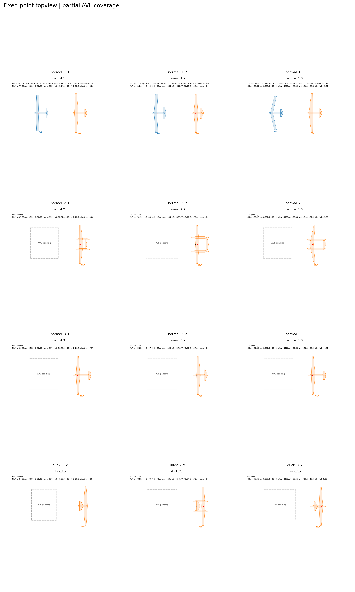

# Original12 Qmission Fixed-Point

This repository groups the two portable workflows for the original 12-branch `q_g_per_ton_km` fixed-point optimization:

- `avl_portable/`: AVL backend
- `mlp_portable/`: MLP split normal/duck backend

Both workflows use the fixed-point logic:

`m0_guess -> cy_req = 9.81 * m0_guess / (q * S_ref) -> trim/sizing -> mtow_out -> update m0_guess`

## What is included

- runnable `src/`
- `init_h500/`
- launcher `.bat` files
- `scripts/`
- `avl_optimize_portable/src_avl_full/`
- MLP models in `mlp_portable/models/`

## What is intentionally excluded

- previous optimization outputs (`gen_*`)
- temporary AVL runs (`runs*`)
- logs
- analysis outputs
- `.rar` archives

## Run

AVL:

- `avl_portable/run_avl_original12_fixedpoint_qmission3000_H500_cy06_optimize.bat`

MLP:

- `mlp_portable/run_mlp_original12_fixedpoint_split300k_qmission3000_H500_cy06_optimize.bat`

## Fixed-Point Topview

Current topview gallery is available in `topview_fixedpoint_partial_20260610/`.

- `3` branches already include `AVL + MLP`: `normal_1_1`, `normal_1_2`, `normal_1_3`
- remaining `9` branches currently show `MLP-only`, with `AVL pending`

Detailed branch-by-branch figures and the summary CSV are stored in:

- `topview_fixedpoint_partial_20260610/top_view_by_branch/`
- `topview_fixedpoint_partial_20260610/topview_summary.csv`
